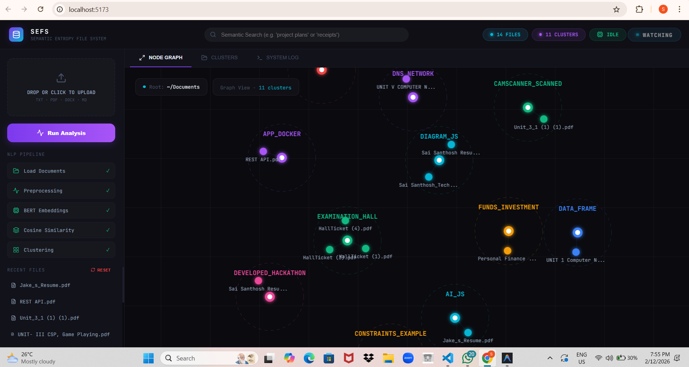
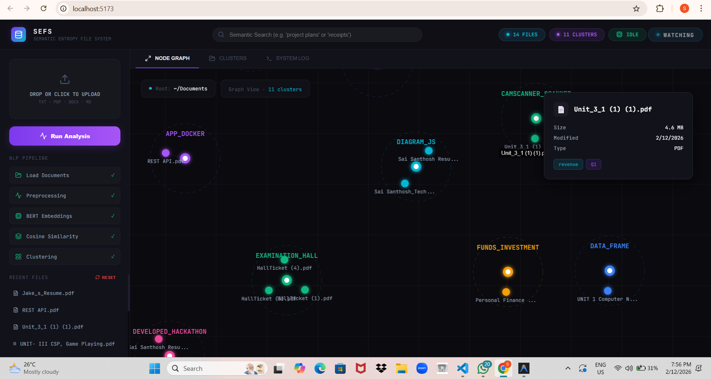
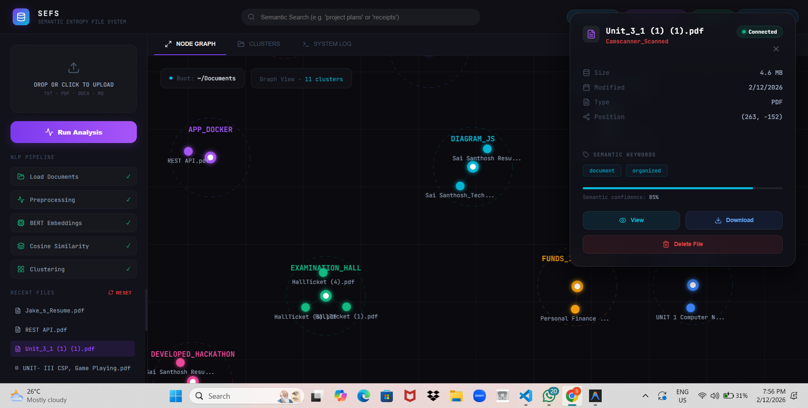
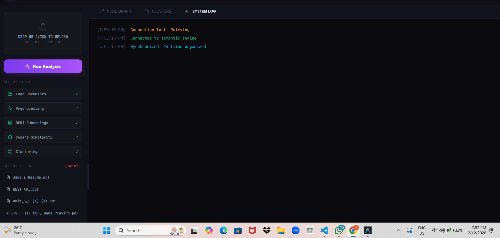
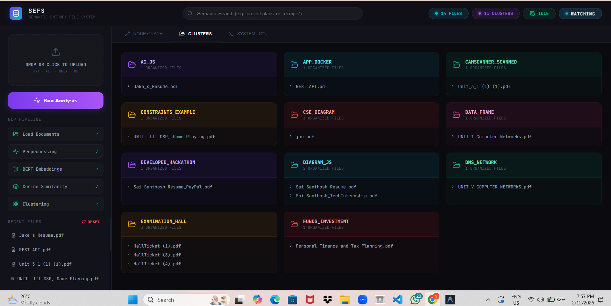

# SEFS: Semantic Entropy File System 🧭

1. Project title 🏷️

SEFS — Semantic Entropy File System

2. Description 📝

SEFS is an AI-powered document organizer that analyzes and semantically clusters files on disk, providing a live web dashboard to explore and manage your organized knowledge base.

3. Tech stack used 🧰

- **Frontend:** React + TypeScript, Vite, `react-force-graph-2d`, `lucide-react`
- **Backend:** Python, FastAPI, Uvicorn, WebSockets
- **AI/NLP:** `sentence-transformers`, `scikit-learn` (DBSCAN / K-Means), TF-IDF
- **Utilities:** Watchdog for file monitoring, PyPDF2 for PDF extraction

4. How to run the project ▶️

Prerequisites: Node.js (v18+), Python 3.8+

Backend (Windows example):

```powershell
cd backend
python -m venv .venv
.\.venv\Scripts\activate
pip install -r requirements.txt
python main.py
```

Frontend:

```bash
cd frontend
npm install
npm run dev
```

By default the frontend Vite dev server runs on http://localhost:5173 and the backend FastAPI server runs on http://localhost:8001 (confirm ports in `backend/main.py`).

5. Dependencies 📦

Backend (from `backend/requirements.txt`):

- `fastapi`
- `uvicorn`
- `watchdog`
- `scikit-learn`
- `numpy`
- `python-multipart`
- `websockets`
- `PyPDF2`
- `sentence-transformers`

Frontend (from `frontend/package.json`):

- `lucide-react`
- `react`
- `react-dom`
- `react-force-graph-2d`

Dev / build tools (frontend devDependencies):

- `typescript`, `vite`, `eslint`, `@vitejs/plugin-react`

6. Any important instructions ⚠️

- Use a virtual environment for Python. Activate before installing dependencies.
- If you change the monitored folder, update the path in [backend/monitor.py](backend/monitor.py) or `main.py`.
- For production, build the frontend (`npm run build`) and serve static files behind a production ASGI server (e.g., Uvicorn/Gunicorn with an ASGI adapter).
- Large models may be downloaded the first time `sentence-transformers` runs; allow time and ensure internet access.

7. Demo videos of MVP 🎥

Place demo video files (e.g., `mvp-demo.mp4`) in a `demo/` folder at the project root and link them here. Example:

- `demo/mvp-demo.mp4` — short walkthrough showing automatic clustering, drag/drop, and file actions.

8. Demo Images of MVP 🖼️

Place screenshots in `demo/` as PNG/JPEG and reference them here, for example:

- `demo/screenshot-dashboard.png` — overview of the interactive graph
- `demo/screenshot-file-inspector.png` — file inspector overlay

Tips: create the `demo/` directory and add files named as above. The README can be updated to embed these with relative links once available.

**Demo Gallery (place screenshots in `demo/`)**












Optional quick links 🔗

- Backend code: [backend](backend)
- Frontend app: [frontend](frontend)
- Example docs monitored by the system: [test_docs](test_docs)

If you'd like, I can add the actual screenshot files from the attachments into `demo/` now — I will need permission to write those image files into the repo. Alternatively you can copy your screenshots into `demo/` using the filenames above and they will appear inline in this README.
